# 0BS1D14N — Open Source Security Scanner

A desktop security scanner for authorised penetration testing. Built with Electron, wrapping 28 industry-standard open source tools in a unified dark UI with live terminal output, real-time finding classification, and professional report export.

> **Legal:** This tool is for authorised security testing only. Only run against systems you own or have explicit written permission to test.

---

## What's new in v0.4.2

- Tool detection completely rewritten — bash script checks all known binary locations reliably
- `proc.on('close')` handler was missing — tool status now correctly sent to renderer
- Profile selection now instantly updates module checkboxes with notification
- testssl binary name fixed (`testssl` not `testssl.sh`)
- rustscan and feroxbuster now install via prebuilt GitHub release binaries — no compilation needed
- All apt installs run as `wsl -u root` — no sudo password prompts ever

---

## Features

- **28 integrated tools** — nmap, nikto, nuclei, ffuf, amass, subfinder, wapiti, hydra, whatweb, sqlmap, testssl, masscan, rustscan, gobuster, feroxbuster, wpscan, crackmapexec, sslscan, theHarvester, shodan, dnsrecon, arjun, enum4linux, snmpwalk, nbtscan, medusa, proxychains4, curl
- **5 scan profiles** — Fast, Stealth, Standard, Hardcore, Auth Test — each auto-selects the correct modules instantly
- **WSL auto-install** — detects WSL on first launch, installs all tools silently, no user interaction
- **Live terminal** — real-time tool output streamed via WebSocket
- **Threat board** — findings classified by severity (CRITICAL / HIGH / MEDIUM / LOW / INFO) with deduplication
- **Risk score** — computed from finding severity weights
- **Professional reports** — dark-themed HTML/PDF export with findings table, TLS posture, security headers
- **Scan history** — saves up to 50 past scans with diff support
- **Scope file** — load multiple targets from a text file, scan all with one click
- **Proxy manager** — proxychains4 integration, rotation modes
- **Metasploit console** — interactive msfconsole terminal
- **CVE lookup** — NVD API integration
- **Schedule** — once/daily/weekly recurring scans
- **Plugins** — drop JS files into `plugins/` to extend functionality
- **Auto-updater** — checks GitHub releases on startup

---

## Requirements

| Platform | Requirements |
|---|---|
| Windows | Node.js 18+, WSL (Ubuntu) |
| Linux | Node.js 18+, npm |
| macOS | Node.js 18+, npm |

---

## Install

```bash
git clone https://github.com/happygream/OBSIDIAN.git
cd OBSIDIAN
npm install
npm start
```

**Windows:** OBSIDIAN detects WSL automatically on first launch and installs all tools silently. No manual WSL setup required beyond having it installed.

```powershell
wsl --install   # if WSL isn't already installed — then restart
```

---

## Scan Profiles

| Profile | Modules | Use Case |
|---|---|---|
| **FAST** | nmap, headers, ffuf, whatweb | Quick initial recon (~3 min) |
| **STEALTH** | nmap, ssl, amass, subfinder, dnsrecon | Low-noise passive recon |
| **STANDARD** | nmap, nikto, nuclei, ffuf, ssl, sslscan, amass, theHarvester | Balanced coverage (~20 min) |
| **HARDCORE** | All 28 tools | Full coverage, all ports |
| **AUTH TEST** | nmap, ffuf, nuclei, hydra, medusa, sqlmap | Login and credential testing |

---

## Tool Coverage

| Tool | Purpose | Install |
|---|---|---|
| nmap | Port scanning and service detection | apt |
| nikto | Web server misconfiguration scanning | apt |
| nuclei | CVE and template-based scanning | go |
| ffuf | Directory and parameter fuzzing | apt |
| amass | Subdomain enumeration | go |
| subfinder | Passive subdomain discovery | go |
| gobuster | Directory/DNS/vhost brute-force | apt |
| feroxbuster | Recursive web content discovery | release |
| wapiti | Web application vulnerability scanning | pip |
| hydra | Network login brute-force | apt |
| medusa | Parallel network brute-force | apt |
| sqlmap | SQL injection detection | apt |
| testssl | TLS/SSL configuration testing | apt |
| sslscan | Cipher and protocol analysis | apt |
| masscan | High-speed port scanning | apt |
| rustscan | Ultra-fast port scanner | release |
| wpscan | WordPress vulnerability scanning | gem |
| whatweb | Web technology fingerprinting | apt |
| theHarvester | OSINT — emails, subdomains, IPs | pip |
| shodan | Shodan API queries | pip |
| dnsrecon | DNS enumeration and zone transfer | apt |
| arjun | HTTP parameter discovery | pip |
| snmpwalk | SNMP enumeration | apt |
| nbtscan | NetBIOS scanner | apt |
| enum4linux | SMB/NetBIOS enumeration | script |
| crackmapexec | SMB/AD testing | manual |
| proxychains4 | Traffic routing through proxies | apt |
| curl | HTTP header analysis | apt |
| metasploit | Exploitation framework | manual |

---

## Stack

- **Electron 29** — desktop wrapper
- **Node.js** — backend and tool process management
- **WebSocket (ws)** — real-time output streaming
- **electron-updater** — auto-update from GitHub releases
- **HTML/CSS/JS** — renderer (no framework)
- **WSL** — Linux toolchain on Windows

---

## Contributing

Pull requests welcome. Read [LEGAL.md](LEGAL.md) before contributing.

- Do not add features that facilitate unauthorised access
- Do not remove or weaken legal warnings

---

## Legal

OBSIDIAN is for authorised security testing only. See [LEGAL.md](LEGAL.md).

Computer Misuse Act 1990 (UK) · Computer Fraud and Abuse Act (US) · EU Directive 2013/40/EU

---

## License

MIT — see LICENSE
